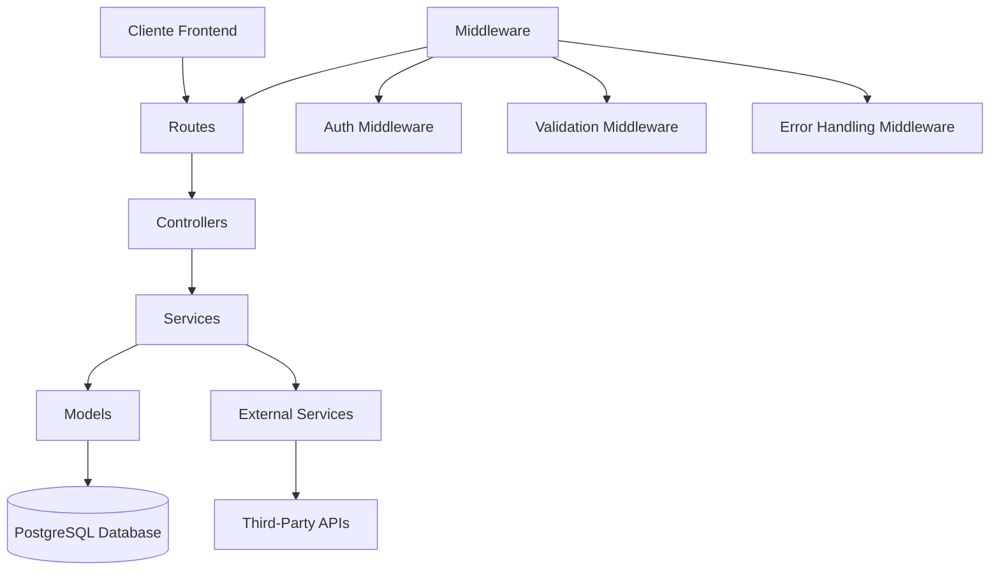

# Arquitetura Backend
> Documento criado: [2025-05-09 01:30:00 UTC]  
> Última atualização: [2025-05-09 01:30:00 UTC]

## Visão Geral

A arquitetura backend da plataforma AliTools B2B E-commerce é baseada em Node.js e Express, seguindo uma organização em camadas que promove a separação de responsabilidades, manutenibilidade e testabilidade.

## Diagrama da Arquitetura Backend



## Componentes Principais

### 1. Rotas (Routes)
- Definição dos endpoints da API
- Mapeamento de verbos HTTP para controllers
- Agrupamento lógico por domínio
- Documentação via JSDoc para OpenAPI/Swagger

### 2. Middleware
- **Autenticação**: Verificação de tokens JWT
- **Validação**: Validação de entrada com Joi/express-validator
- **Logging**: Registro de requisições e respostas
- **Tratamento de Erros**: Captura e formatação padronizada
- **CORS**: Configuração de Cross-Origin Resource Sharing
- **Compressão**: Compressão de respostas HTTP

### 3. Controllers
- Processamento de requisições HTTP
- Validação de entrada
- Chamada aos serviços apropriados
- Formatação das respostas
- Tratamento de status HTTP

### 4. Serviços (Services)
- Lógica de negócio principal
- Orquestração de operações
- Chamadas a múltiplos models quando necessário
- Interação com serviços externos
- Tratamento de erros de domínio

### 5. Models
- Definição de schema usando Sequelize
- Interação com banco de dados
- Implementação de métodos de acesso a dados
- Validações de nível de banco de dados

### 6. Utilitários (Utils)
- Funções de ajuda reutilizáveis
- Formatadores de dados
- Manipulação de datas e horas
- Geradores de tokens/IDs

## Estrutura de Diretórios

```
server/
├── src/
│   ├── config/           # Configurações da aplicação
│   ├── controllers/      # Controladores da API
│   ├── middleware/       # Middleware da aplicação
│   ├── models/           # Modelos de dados e ORM
│   ├── routes/           # Definição de rotas da API
│   ├── scripts/          # Scripts utilitários
│   ├── services/         # Serviços de negócio
│   └── utils/            # Funções utilitárias
├── tests/                # Testes automatizados
└── index.js              # Ponto de entrada da aplicação
```

## Padrões e Práticas

### Injeção de Dependências
```javascript
// Exemplo de injeção de dependência em um serviço
class ProductService {
  constructor(productRepository, categoryRepository) {
    this.productRepository = productRepository;
    this.categoryRepository = categoryRepository;
  }
  
  async getProductsWithCategories() {
    const products = await this.productRepository.findAll();
    const categories = await this.categoryRepository.findAll();
    // Processar e retornar dados
  }
}

// Uso:
const productService = new ProductService(
  new ProductRepository(),
  new CategoryRepository()
);
```

### Tratamento de Erros Centralizado
```javascript
// Middleware de tratamento de erros
const errorHandler = (err, req, res, next) => {
  // Erros conhecidos da aplicação
  if (err instanceof AppError) {
    return res.status(err.statusCode).json({
      status: 'error',
      message: err.message,
      code: err.errorCode
    });
  }
  
  // Erros do banco de dados
  if (err instanceof DatabaseError) {
    logger.error('Database error', err);
    return res.status(500).json({
      status: 'error',
      message: 'Um erro ocorreu no banco de dados',
      code: 'DB_ERROR'
    });
  }
  
  // Erros não tratados
  logger.error('Unhandled error', err);
  return res.status(500).json({
    status: 'error',
    message: 'Erro interno no servidor',
    code: 'INTERNAL_SERVER_ERROR'
  });
};
```

## APIs e Integrações

### API RESTful
- Estrutura de recursos bem definida (products, orders, customers, etc.)
- Operações CRUD mapeadas para verbos HTTP 
- Paginação, ordenação e filtragem de recursos
- Versionamento de API (v1, v2, etc.)
- Formato de resposta padronizado

### Integração com GEKO XML API
- Importação de catálogo de produtos em XML
- Agendamento de sincronização periódica
- Transformação e normalização de dados
- Mapeamento para modelo de dados interno

## Autenticação e Autorização

- **Autenticação**: Baseada em JWT (JSON Web Token)
- **Autorização**: Controle de acesso baseado em funções (RBAC)
- **Refresh Tokens**: Para renovação segura de sessões
- **Blacklisting**: De tokens revogados ou expirados

## Estratégia de Banco de Dados

- PostgreSQL como sistema principal
- Sequelize como ORM para mapeamento objeto-relacional
- Migrações para versionamento do schema
- Seeds para dados iniciais
- Transações para operações ACID

## Estratégia de Cache

- Redis para armazenamento em memória
- Cache de consultas frequentes
- Cache de sessões de usuário
- Invalidação seletiva de cache

## Testes

- **Testes Unitários**: Testando componentes isoladamente
- **Testes de Integração**: Testando interações entre componentes
- **Testes de API**: Testando endpoints HTTP
- **Mocks e Stubs**: Para isolamento de dependências externas

## Segurança

- Validação de entrada em todos os endpoints
- Sanitização de dados para prevenir injeções
- Rate limiting para prevenção de ataques de força bruta
- Helmet para cabeçalhos HTTP seguros
- Monitoramento de vulnerabilidades em dependências

## Logging e Monitoramento

- Logs estruturados para fácil análise
- Níveis de log configuráveis (debug, info, warn, error)
- Logs de transações importantes para auditoria
- Métricas de performance e uso

## Infraestrutura e Deploy

- Containerização com Docker para desenvolvimento
- Deploy em Vercel para produção
- Variáveis de ambiente para configuração
- Estratégia de migração de banco de dados em deployment

## Próximos Passos

- Evolução para arquitetura de microserviços
- Implementação de filas de mensagens para processamento assíncrono
- Expansão de testes de integração
- Implementação de GraphQL para consultas flexíveis

## Documentos Relacionados
- [Visão Geral da Arquitetura](./overview.md)
- [Arquitetura Frontend](./frontend.md)
- [Modelo de Dados](./data-model.md)
- [Integração com Serviços Externos](./external-services.md) 