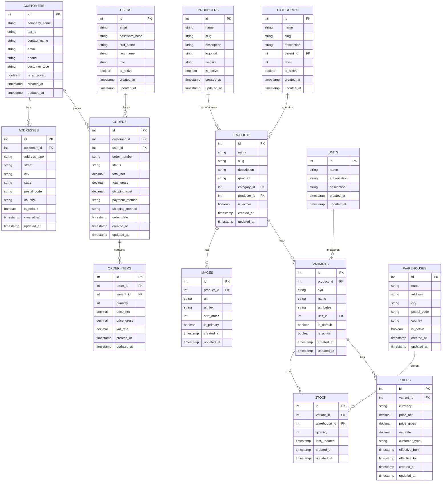

# Modelo de Dados
> Documento criado: [2025-05-09 02:00:00 UTC]  
> Última atualização: [2025-05-09 02:00:00 UTC]

## Visão Geral

Este documento descreve o modelo de dados da plataforma AliTools B2B E-commerce, detalhando as principais entidades, seus atributos e relacionamentos. O sistema utiliza PostgreSQL como banco de dados relacional e Sequelize como ORM para mapeamento objeto-relacional.

## Diagrama de Entidade Relacionamento

## Entidades Principais

### Usuários (Users)
Representa todos os usuários que podem acessar o sistema administrativo. Cada usuário possui um papel (role) que determina suas permissões.

**Campos notáveis:**
- `role`: Define o papel do usuário (admin, manager, sales, etc.)
- `is_active`: Indica se a conta de usuário está ativa ou desativada

### Clientes (Customers)
Representa empresas ou organizações que são clientes no sistema B2B.

**Campos notáveis:**
- `company_name`: Nome da empresa cliente
- `tax_id`: Identificação fiscal (NIF, CNPJ, etc.)
- `customer_type`: Tipo de cliente (distribuidor, varejista, etc.)
- `is_approved`: Indica se o cliente passou pelo processo de aprovação

### Categorias (Categories)
Estrutura hierárquica para classificação de produtos.

**Campos notáveis:**
- `parent_id`: Referência à categoria pai, permite estrutura multinível
- `level`: Nível na hierarquia de categorias
- `slug`: Versão URL-friendly do nome da categoria

### Produtores (Producers)
Fabricantes dos produtos disponíveis no catálogo.

**Campos notáveis:**
- `name`: Nome do fabricante
- `logo_url`: URL para a imagem do logotipo do fabricante
- `website`: Site oficial do fabricante

### Produtos (Products)
Itens do catálogo que podem ser vendidos.

**Campos notáveis:**
- `geko_id`: Identificador do produto no sistema GEKO (integração XML)
- `category_id`: Referência à categoria do produto
- `producer_id`: Referência ao fabricante do produto

### Variantes (Variants)
Diferentes versões ou configurações de um produto.

**Campos notáveis:**
- `sku`: Código único de identificação do produto/variante
- `attributes`: Atributos específicos da variante (JSON)
- `is_default`: Indica se é a variante padrão do produto
- `unit_id`: Referência à unidade de medida

### Preços (Prices)
Preços para variantes de produtos, considerando diferentes tipos de clientes e períodos de validade.

**Campos notáveis:**
- `price_net`: Preço líquido (sem impostos)
- `price_gross`: Preço bruto (com impostos)
- `vat_rate`: Taxa de IVA aplicada
- `customer_type`: Tipo de cliente ao qual o preço se aplica
- `effective_from` e `effective_to`: Período de validade do preço

### Estoque (Stock)
Controle de estoque para variantes de produtos em diferentes armazéns.

**Campos notáveis:**
- `quantity`: Quantidade disponível em estoque
- `warehouse_id`: Referência ao armazém onde o estoque está localizado
- `last_updated`: Timestamp da última atualização do estoque

### Pedidos (Orders)
Pedidos feitos por clientes, contendo múltiplos itens.

**Campos notáveis:**
- `order_number`: Número de referência do pedido
- `status`: Estado atual do pedido (novo, processando, enviado, etc.)
- `total_net`: Valor total líquido do pedido
- `total_gross`: Valor total bruto do pedido
- `payment_method`: Método de pagamento utilizado
- `shipping_method`: Método de envio selecionado

## Relacionamentos Chave

1. **Customers → Addresses**: Um cliente pode ter múltiplos endereços (faturamento, entrega, etc.)
2. **Products → Variants**: Um produto pode ter múltiplas variantes
3. **Variants → Prices**: Uma variante pode ter múltiplos preços (por tipo de cliente, período, etc.)
4. **Variants → Stock**: Uma variante possui estoque em diferentes armazéns
5. **Categories → Products**: Uma categoria contém múltiplos produtos
6. **Producers → Products**: Um produtor fabrica múltiplos produtos
7. **Orders → Order Items**: Um pedido contém múltiplos itens

## Restrições e Validações

### Integridade Referencial
- Todas as chaves estrangeiras possuem constraints para garantir integridade referencial
- Exclusões em cascata são evitadas para preservar histórico de dados

### Validações de Nível de Modelo
- Todos os emails devem ser únicos e em formato válido
- Preços não podem ser negativos
- Estoque não pode ser negativo (exceto em casos específicos de backorder)
- Slugs devem ser únicos e conter apenas caracteres válidos para URL

## Índices

### Índices Primários
- Índices de chave primária em todas as tabelas (`id`)

### Índices Secundários
- Índices em chaves estrangeiras para otimizar operações de JOIN
- Índice em `products.name` para facilitar busca textual
- Índice em `products.slug` para lookup rápido na API
- Índice composto em `variants.product_id` e `variants.sku` para consultas de produto
- Índice em `orders.customer_id` para filtrar pedidos por cliente
- Índice em `stock.variant_id` para verificação rápida de disponibilidade

## Estratégia de Migração

O esquema de banco de dados é gerenciado através do sistema de migração do Sequelize, que permite:

1. Controle de versão do esquema de banco de dados
2. Migrações incrementais e reversíveis
3. Sincronização entre ambientes de desenvolvimento, teste e produção

Os arquivos de migração são armazenados em `server/src/migrations/` e executados em ordem cronológica.

## Seed Data

Dados iniciais são carregados através de seeders para:

1. Usuários administrativos padrão
2. Categorias de produtos básicas
3. Unidades de medida comuns
4. Configurações de sistema
5. Dados de teste para desenvolvimento

## Considerações de Performance

- Campos de timestamp (`created_at`, `updated_at`) são automaticamente gerenciados pelo Sequelize
- Índices são criados estrategicamente para otimizar consultas frequentes
- Relacionamentos são projetados para minimizar JOINs complexos
- Campos JSON são utilizados para dados flexíveis mas não frequentemente consultados

## Documentos Relacionados
- [Documentação Detalhada do Schema](../database/database-schema.md)
- [Documentação de Índices](../database/database-indexes.md)
- [Visão Geral da Arquitetura](./overview.md)
- [Arquitetura Backend](./backend.md) 