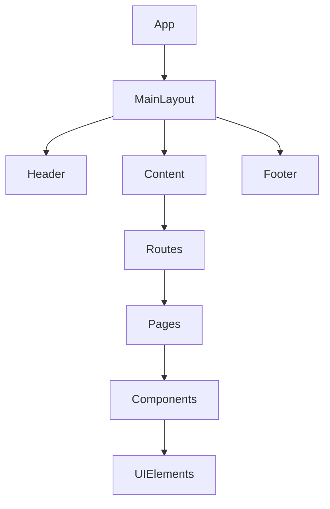
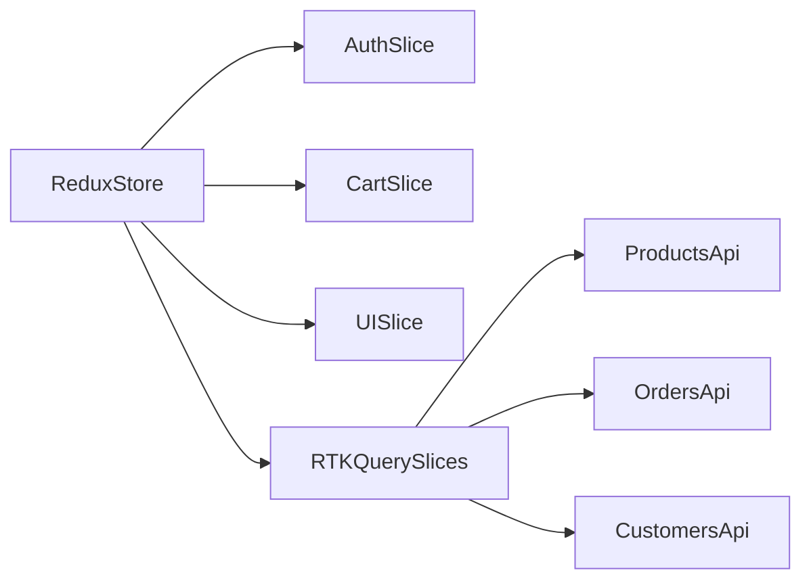
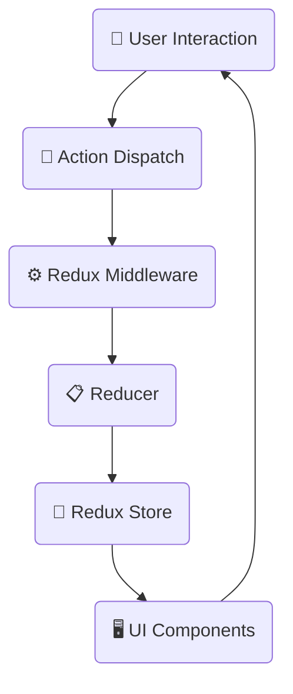

# Arquitetura Frontend
> Documento criado: [2025-05-09 01:25:00 UTC]  
> Última atualização: [2025-05-09 01:25:00 UTC]

## Visão Geral

O frontend da plataforma AliTools B2B E-commerce é construído como uma aplicação de página única (SPA) utilizando React para componentes de UI, Redux para gerenciamento de estado, e uma organização modular focada em escalabilidade e manutenibilidade.

### Principais Objetivos da Arquitetura Frontend

- Proporcionar uma experiência de usuário fluida e responsiva
- Manter o código modular e facilmente manutenível
- Aplicar separação de responsabilidades
- Facilitar os testes automatizados
- Suportar múltiplos dispositivos e tamanhos de tela

## Estrutura de Diretórios

A aplicação frontend está organizada na seguinte estrutura:

```
client/
├── public/             # Arquivos estáticos e index.html
│   └── assets/         # Recursos estáticos (imagens, fontes, etc.)
├── src/
│   ├── assets/         # Recursos importados no código
│   │   ├── icons/      # Ícones organizados por categoria
│   │   ├── logos/      # Logos da marca em diferentes formatos
│   │   └── styles/     # Estilos e tokens de design
│   ├── components/     # Componentes React reutilizáveis
│   │   ├── auth/       # Componentes de autenticação
│   │   ├── cart/       # Componentes do carrinho de compras
│   │   ├── checkout/   # Componentes de checkout
│   │   ├── customers/  # Componentes de gestão de clientes
│   │   ├── layouts/    # Layouts reutilizáveis (Header, Footer, etc.)
│   │   ├── orders/     # Componentes relacionados a pedidos
│   │   ├── products/   # Componentes de catálogo e detalhes de produto
│   │   ├── reports/    # Componentes de relatórios
│   │   └── ui/         # Componentes UI genéricos (Button, Input, etc.)
│   ├── hooks/          # Custom hooks React
│   ├── pages/          # Componentes de página
│   │   ├── admin/      # Páginas de administração
│   │   ├── auth/       # Páginas de autenticação
│   │   └── user/       # Páginas de usuário/cliente
│   ├── store/          # Configuração do Redux e gerenciamento de estado
│   │   ├── api/        # API slices do RTK Query
│   │   └── slices/     # Redux slices para gestão de estado
│   ├── tests/          # Testes automatizados
│   │   ├── integration/# Testes de integração
│   │   └── unit/       # Testes unitários
│   └── utils/          # Funções utilitárias e helpers
```

## Tecnologias e Bibliotecas

| Tecnologia / Biblioteca | Versão | Propósito |
|-------------------------|--------|-----------|
| React                   | 18.x   | Construção de interfaces de usuário |
| Redux Toolkit           | 2.x    | Gerenciamento de estado aplicacional |
| RTK Query               | 2.x    | Gerenciamento de estado de API e caching |
| React Router            | 6.x    | Roteamento de páginas no cliente |
| Tailwind CSS            | 3.x    | Framework CSS utilitário para estilização |
| React Hook Form         | 7.x    | Gerenciamento de formulários |
| Vitest                  | 1.x    | Framework de testes |
| React Testing Library   | 14.x   | Testes de componentes React |

## Arquitetura de Componentes

### Hierarquia de Componentes



### Tipos de Componentes

1. **Componentes de UI Base**:
   - Botões, inputs, selects, cards, etc.
   - Totalmente reutilizáveis
   - Não possuem estado de negócio ou lógica específica

2. **Componentes Compostos**:
   - Combinam componentes de UI base
   - Possuem lógica específica para um domínio
   - Exemplos: ProductCard, CartItem, OrderSummary

3. **Componentes de Layout**:
   - Estruturam a disposição dos componentes na página
   - Exemplos: Header, Footer, Sidebar, PageLayout

4. **Componentes de Página**:
   - Representam páginas completas da aplicação
   - Consomem dados da API e do estado global
   - Gerenciam o fluxo da página

### Padrão de Composição de Componentes

Os componentes são construídos seguindo padrões para maximizar reusabilidade:

- **Componentes Controlados**: Estado gerenciado pelo componente pai
- **Padrão de Prop Drilling Limitado**: Uso de Context para evitar prop drilling excessivo
- **Memoização**: Uso de React.memo e useMemo para otimização
- **Custom Hooks**: Encapsulamento de lógica complexa em hooks reutilizáveis

## Gerenciamento de Estado

### Redux Store

O gerenciamento de estado global é implementado com Redux Toolkit, organizando o estado em slices:



### RTK Query

O RTK Query é utilizado para gerenciamento de estado de API, fornecendo:

- Caching automático de respostas
- Gerenciamento de estados de loading
- Tratamento de erros padronizado
- Refetch automático de dados quando necessário
- Invalidação automática de cache

```javascript
// Exemplo de definição de API slice
export const apiSlice = createApi({
  reducerPath: 'api',
  baseQuery: fetchBaseQuery({ 
    baseUrl: '/api/v1/',
    prepareHeaders: (headers, { getState }) => {
      const token = getState().auth.token;
      if (token) {
        headers.set('authorization', `Bearer ${token}`);
      }
      return headers;
    },
  }),
  tagTypes: ['Product', 'Order', 'Customer'],
  endpoints: (builder) => ({})
});
```

### Estado Local vs. Estado Global

**Estado Global (Redux)**:
- Dados compartilhados entre componentes
- Dados persistentes através de navegações
- Estado de autenticação
- Carrinho de compras
- Preferências de usuário
- Dados de API com caching

**Estado Local (useState/useReducer)**:
- Estado de UI (forms, modais, acordeões)
- Estado transitório (hover, focus)
- Dados específicos de um componente sem necessidade de compartilhamento

## Fluxo de Dados

### Fluxo de Dados Unidirecional



### Padrão de Comunicação com API

1. **Criação de Endpoints no RTK Query**:
   ```javascript
   // products.api.js
   export const productsApi = apiSlice.injectEndpoints({
     endpoints: (builder) => ({
       getProducts: builder.query({
         query: (params) => ({
           url: 'products',
           params,
         }),
         providesTags: ['Products']
       }),
       // outras queries e mutations
     }),
   });
   ```

2. **Uso nos Componentes**:
   ```jsx
   // ProductsList.jsx
   function ProductsList() {
     const { data, isLoading, error } = useGetProductsQuery({ 
       page: 1, 
       limit: 10 
     });
     
     // Renderização com dados, loading states e tratamento de erros
   }
   ```

## Estratégias de Estilização

A estilização é implementada com Tailwind CSS com algumas diretrizes:

- Classes utilitárias no JSX para estilos comuns
- Componentes estilizados para padrões complexos reutilizáveis
- Variáveis CSS para tokens de design (cores, espaçamentos, etc.)
- Design system tokens para consistência visual

### Design Tokens

```css
:root {
  /* Colors */
  --color-primary: #FFCC00;
  --color-secondary: #1A1A1A;
  --color-background: #FFFFFF;
  --color-text: #333333;
  
  /* Spacing */
  --spacing-xs: 0.25rem;
  --spacing-sm: 0.5rem;
  --spacing-md: 1rem;
  --spacing-lg: 1.5rem;
  --spacing-xl: 2rem;
  
  /* Typography */
  --font-family: 'Inter', sans-serif;
  --font-size-sm: 0.875rem;
  --font-size-md: 1rem;
  --font-size-lg: 1.25rem;
  --font-size-xl: 1.5rem;
}
```

## Estratégia de Roteamento

O roteamento é implementado com React Router v6:

```jsx
// App.jsx
function App() {
  return (
    <BrowserRouter>
      <Routes>
        <Route path="/" element={<MainLayout />}>
          <Route index element={<HomePage />} />
          <Route path="products" element={<ProductsPage />} />
          <Route path="products/:id" element={<ProductDetailPage />} />
          <Route path="cart" element={<CartPage />} />
          <Route path="checkout" element={<CheckoutPage />} />
          
          {/* Rotas protegidas */}
          <Route path="account" element={
            <ProtectedRoute>
              <AccountPage />
            </ProtectedRoute>
          } />
          
          {/* Rotas de administração */}
          <Route path="admin" element={
            <AdminRoute>
              <AdminLayout />
            </AdminRoute>
          }>
            <Route index element={<DashboardPage />} />
            <Route path="products" element={<AdminProductsPage />} />
            {/* Outras rotas de admin */}
          </Route>
          
          {/* Rotas de autenticação */}
          <Route path="auth" element={<AuthLayout />}>
            <Route path="login" element={<LoginPage />} />
            <Route path="register" element={<RegisterPage />} />
            <Route path="forgot-password" element={<ForgotPasswordPage />} />
          </Route>
          
          {/* Fallback para 404 */}
          <Route path="*" element={<NotFoundPage />} />
        </Route>
      </Routes>
    </BrowserRouter>
  );
}
```

## Performance

### Estratégias de Otimização

1. **Code Splitting**:
   ```jsx
   const ProductDetailPage = React.lazy(() => import('./pages/ProductDetailPage'));
   
   function App() {
     return (
       <Routes>
         <Route path="/products/:id" element={
           <Suspense fallback={<Loader />}>
             <ProductDetailPage />
           </Suspense>
         } />
       </Routes>
     );
   }
   ```

2. **Memoização de Componentes e Cálculos**:
   ```jsx
   const MemoizedComponent = React.memo(ExpensiveComponent);
   
   function ParentComponent() {
     const memoizedValue = useMemo(() => computeExpensiveValue(a, b), [a, b]);
     const memoizedCallback = useCallback(() => { doSomething(a, b); }, [a, b]);
     
     return <MemoizedComponent value={memoizedValue} onClick={memoizedCallback} />;
   }
   ```

3. **Virtualização para Listas Longas**:
   ```jsx
   import { FixedSizeList } from 'react-window';
   
   function ProductList({ products }) {
     return (
       <FixedSizeList
         height={500}
         width="100%"
         itemCount={products.length}
         itemSize={100}
       >
         {({ index, style }) => (
           <ProductItem style={style} product={products[index]} />
         )}
       </FixedSizeList>
     );
   }
   ```

4. **Otimização de Imagens**:
   - Uso de formatos modernos (WebP)
   - Dimensionamento adequado
   - Lazy loading

## Testes

### Estratégia de Testes

A estratégia de testes adota uma abordagem de pirâmide de testes:

```
        ╱▔▔▔▔▔▔▔▔▔▔▔▔╲
       ╱    E2E Tests   ╲
      ╱                  ╲
     ╱   Integration      ╲
    ╱      Tests           ╲
   ╱                        ╲
  ╱       Unit Tests         ╲
 ╱                            ╲
▔▔▔▔▔▔▔▔▔▔▔▔▔▔▔▔▔▔▔▔▔▔▔▔▔▔▔▔▔▔▔▔
```

### Tipos de Testes

1. **Testes Unitários**: Testam componentes individuais isoladamente
   ```jsx
   // Button.test.jsx
   test('renders button with correct text', () => {
     render(<Button>Click me</Button>);
     const buttonElement = screen.getByText(/click me/i);
     expect(buttonElement).toBeInTheDocument();
   });
   ```

2. **Testes de Integração**: Testam a interação entre componentes
   ```jsx
   // ProductList.test.jsx
   test('displays products from API', async () => {
     // Mock do serviço de API
     server.use(
       rest.get('/api/products', (req, res, ctx) => {
         return res(ctx.json({ data: mockProducts }));
       })
     );
     
     render(<ProductList />);
     
     // Verifica se produtos são exibidos após carregamento
     const productItems = await screen.findAllByTestId('product-item');
     expect(productItems).toHaveLength(mockProducts.length);
   });
   ```

3. **Testes End-to-End**: Testam fluxos completos de usuário
   ```javascript
   // checkout.spec.js (usando Cypress)
   describe('Checkout Flow', () => {
     it('allows user to complete purchase', () => {
       cy.login('customer@example.com', 'password');
       cy.visit('/products');
       cy.findByText('Product One').click();
       cy.findByText('Add to Cart').click();
       cy.visit('/cart');
       cy.findByText('Proceed to Checkout').click();
       // Complete o fluxo de checkout
       cy.findByText('Thank you for your order').should('be.visible');
     });
   });
   ```

## Acessibilidade

### Princípios de Acessibilidade

- Semântica HTML adequada
- Contraste de cores para visibilidade
- Navegação por teclado
- Suporte a leitores de tela
- Textos alternativos para imagens
- Componentes conforme ARIA

```jsx
// Exemplo de botão acessível
function AccessibleButton({ onClick, children, isDisabled }) {
  return (
    <button
      onClick={onClick}
      disabled={isDisabled}
      aria-disabled={isDisabled}
      className={`btn ${isDisabled ? 'btn-disabled' : 'btn-primary'}`}
    >
      {children}
    </button>
  );
}
```

## Internacionalização (i18n)

A aplicação suporta múltiplos idiomas (português, inglês) utilizando:

- Componente de tradução
- Armazenamento de strings em arquivos de tradução
- Detecção automática de idioma do navegador
- Persistência da preferência de idioma

## Próximos Passos

Evoluções planejadas para a arquitetura frontend:

1. Migração para React Server Components (quando houver maturidade)
2. Adoção de Suspense para carregamento de dados
3. Implementação de Progressive Web App (PWA)
4. Melhoria na análise de performance com Core Web Vitals
5. Expansão dos testes automatizados

## Documentos Relacionados
- [Visão Geral da Arquitetura](./overview.md)
- [Arquitetura Backend](./backend.md)
- [Design System](../branding/design-system.md) 