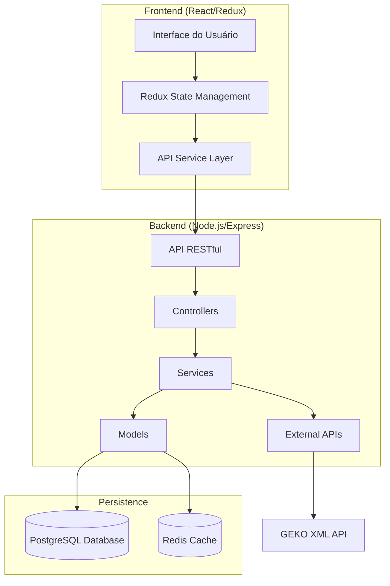

# Visão Geral da Arquitetura
> Documento criado: [2025-05-09 01:20:00 UTC]  
> Última atualização: [2025-05-09 01:20:00 UTC]

## Introdução

Este documento apresenta uma visão geral da arquitetura da plataforma AliTools B2B E-commerce, descrevendo os principais componentes do sistema, padrões arquiteturais, tecnologias utilizadas e as interações entre os diversos módulos da aplicação.

## Arquitetura de Alto Nível

A plataforma AliTools B2B E-commerce segue uma arquitetura de aplicação web moderna, organizada como uma aplicação de página única (SPA) no frontend com uma API RESTful no backend. A arquitetura foi projetada para ser escalável, manutenível e com separação clara de responsabilidades.

### Diagrama de Arquitetura

## Componentes Principais

### Frontend
- **Interface do Usuário**: Componentes React para renderização de UI
- **Gerenciamento de Estado**: Redux + Redux Toolkit para gerenciamento de estado
- **Camada de Serviço API**: Serviços para comunicação com o backend via RTK Query
- **Roteamento**: React Router para navegação entre páginas
- **Formulários**: React Hook Form para gerenciamento de formulários
- **Estilização**: Tailwind CSS para estilos

### Backend
- **API RESTful**: Express.js para exposição de endpoints HTTP
- **Controladores**: Lógica de controle de requisições
- **Serviços**: Lógica de negócio e operações
- **Modelos**: Definição de schema e interação com banco de dados via Sequelize
- **Middleware**: Componentes para autenticação, validação, logging, etc.

### Persistência
- **Banco de Dados**: PostgreSQL como banco de dados principal
- **Cache**: Redis para caching de dados frequentemente acessados

### Integrações Externas
- **GEKO API**: Integração para importação de catálogo de produtos via XML

## Padrões Arquiteturais

### Padrões Aplicados
- **Arquitetura em Camadas**: Separação clara entre UI, lógica de aplicação e acesso a dados
- **Repository Pattern**: Abstração da lógica de acesso a dados
- **Service Layer**: Encapsulamento da lógica de negócio
- **Observer Pattern**: Através de Redux para notificações de mudanças de estado
- **Factory Pattern**: Criação de objetos complexos em serviços
- **Strategy Pattern**: Diferentes estratégias para processamento de pagamentos

### Desacoplamento e Modularidade
O sistema é organizado em módulos coesos com interfaces bem definidas, permitindo:
- Desenvolvimento independente de componentes
- Testabilidade melhorada
- Facilidade de manutenção
- Possibilidade de substituição de implementações

## Fluxo de Dados

### Fluxo de Requisição Típico
1. Usuário interage com componente React
2. Componente dispara ação Redux
3. Middleware do Redux processa a ação (ex: chamada à API)
4. API Express recebe a requisição
5. Middleware Express processa a requisição (autenticação, etc.)
6. Controller recebe a requisição e coordena a resposta
7. Service executa a lógica de negócio
8. Model interage com o banco de dados
9. Resposta segue o caminho inverso até o usuário

## Tecnologias Principais

### Frontend
- **React**: Biblioteca para construção de interfaces
- **Redux/Redux Toolkit**: Gerenciamento de estado
- **RTK Query**: Gerenciamento de dados e caching
- **React Router**: Roteamento do lado do cliente
- **Tailwind CSS**: Framework CSS para estilização

### Backend
- **Node.js**: Ambiente de execução JavaScript
- **Express.js**: Framework web para Node.js
- **Sequelize**: ORM para Node.js
- **Passport.js**: Middleware de autenticação
- **JWT**: Tokens para autenticação

### Banco de Dados
- **PostgreSQL**: Sistema de gerenciamento de banco de dados relacional
- **Redis**: Armazenamento em memória para caching

### DevOps
- **Vercel**: Plataforma de hospedagem e deploy
- **GitHub Actions**: CI/CD
- **Docker**: Containerização para desenvolvimento

## Considerações de Segurança

A arquitetura foi projetada com segurança em mente, incluindo:
- Autenticação baseada em JWT
- Autorização com controle de acesso baseado em funções (RBAC)
- Validação de entrada em múltiplas camadas
- Proteção contra vulnerabilidades comuns (CSRF, XSS, Injection)
- Rate limiting para prevenção de ataques de força bruta
- HTTPS para comunicação segura

## Escalabilidade e Performance

Estratégias para garantir escalabilidade e performance:
- Caching de dados frequentemente acessados
- Otimização de consultas ao banco de dados
- Paginação de resultados
- Indexação eficiente
- Compressão de resposta
- Code splitting no frontend
- Lazy loading de componentes

## Compatibilidade

A plataforma é projetada para ser compatível com:
- Navegadores modernos (Chrome, Firefox, Safari, Edge)
- Dispositivos móveis e desktops (design responsivo)
- Acessibilidade WCAG 2.1

## Próximos Passos na Arquitetura

Áreas de evolução planejadas:
- Implementação de microserviços para componentes específicos
- Adoção de GraphQL para consultas mais eficientes
- Implementação de WebSockets para funcionalidades em tempo real
- Expansão da infraestrutura para suportar alta disponibilidade

## Documentos Relacionados
- [Arquitetura Frontend](./frontend.md)
- [Arquitetura Backend](./backend.md)
- [Modelo de Dados](./data-model.md)
- [Integração com Serviços Externos](./external-services.md)
- [Infraestrutura e Deployment](./infrastructure.md) 