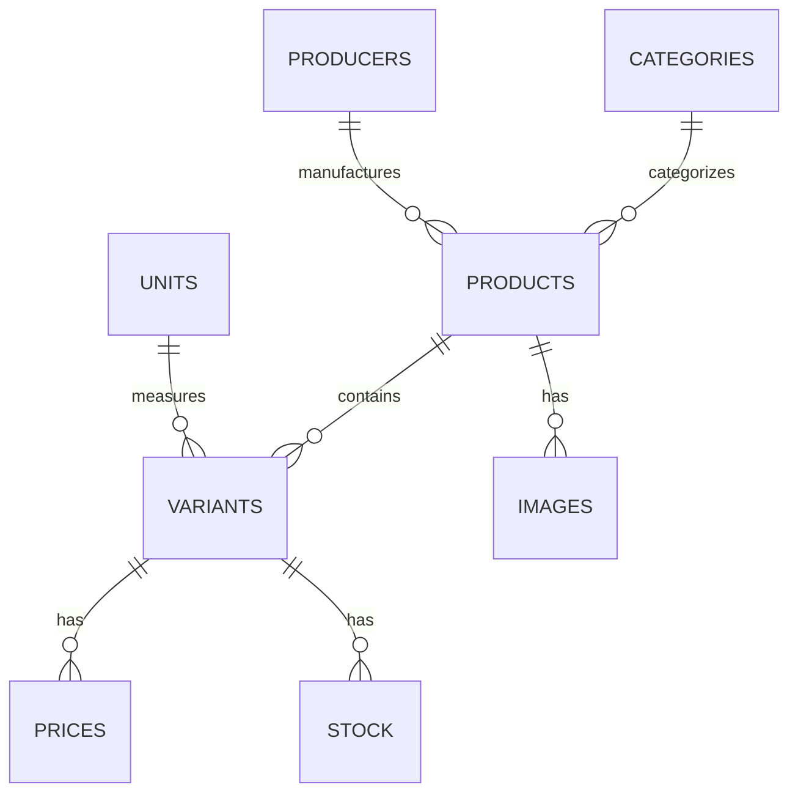

# Documentação do Banco de Dados
> Documento criado: [2024-05-05 13:00:00]  
> Última atualização: [2025-05-08 23:50:00 UTC]

## Visão Geral

Este diretório contém documentação relacionada à estrutura e configuração do banco de dados para a plataforma AliTools B2B.

## Documentos Principais

- [Esquema de Banco de Dados](./database-schema.md) - Esquema completo do banco de dados com tabelas, campos, restrições e relacionamentos
- [Índices de Banco de Dados](./database-indexes.md) - Configurações de índices para otimizar o desempenho do banco de dados
- [Dados de Teste](./seed-data.md) - Informações sobre geração de dados de amostra para desenvolvimento e testes
- [Importador de Dados](./data-scraper.md) - Documentação para as ferramentas usadas para importar e extrair dados de produtos

## Referência Rápida de Relacionamentos de Entidades



## Visão Geral das Tabelas Principais

| Nome da Tabela | Descrição | Campos Principais |
|------------|-------------|------------|
| products | Informações essenciais do produto | id, code, name, description |
| categories | Categorias de produtos | id, name, path |
| variants | Variações de produtos | id, product_id, code, weight |
| prices | Informações de preços | id, variant_id, gross_price, net_price |
| stock | Quantidades de inventário | id, variant_id, warehouse_id, quantity |
| producers | Fabricantes | id, name |
| images | Imagens de produtos | id, product_id, url |

## Convenções de Banco de Dados

- Todas as tabelas incluem timestamps `created_at` e `updated_at`
- Chaves primárias são nomeadas como `id` em todo o banco de dados
- Chaves estrangeiras seguem o padrão `tabela_id` (ex: `product_id`)
- Campos de texto utilizam o tipo de dados `TEXT` em vez de `VARCHAR` para flexibilidade
- Campos de preço utilizam `NUMERIC(10,2)` para precisão
- A maioria dos relacionamentos é mantida por meio de chaves estrangeiras com restrições apropriadas 

## Práticas Recomendadas

### Consultas

- Use consultas parametrizadas para evitar injeção de SQL
- Prefira JOIN em vez de múltiplas consultas para dados relacionados
- Utilizar transações para operações que afetam múltiplas tabelas
- Evite consultas SELECT * em tabelas grandes

### Migrations

- Toda alteração de esquema deve ser feita via migrations
- Migrations devem incluir rollback apropriado
- Cada migration deve ter um propósito único e claro
- Documente alterações significativas no esquema

### Operações de Dados

- Utilize bulk inserts para grandes conjuntos de dados
- Implementar validação de dados antes da inserção
- Definir estratégias claras para lidar com conflitos de dados
- Manter histórico de alterações para dados críticos

## Scripts e Ferramentas

Os scripts relacionados ao banco de dados podem ser encontrados em:

- Migrations: `server/src/migrations/`
- Seeds: `server/src/seeders/`
- Modelos: `server/src/models/`
- Utilidades: `server/src/utils/database/`

## Monitoramento e Manutenção

- Logs de consultas lentas são ativados no ambiente de desenvolvimento
- Backups são automatizados e ocorrem diariamente
- A manutenção de índices é programada semanalmente
- O monitoramento de desempenho é configurado no painel de administração

# Database Exploration Tools

This directory contains scripts for exploring the Neon PostgreSQL database structure and testing connections.

## Available Scripts

### Basic Database Connection Test

```bash
node docs/database/simple-db-test.js
```

This script establishes a connection to the Neon PostgreSQL database and lists all tables found in the database.

### Table Structure Explorer

```bash
node docs/database/show-table-structure.js <tableName>
```

This script displays detailed information about a specific table including:
- Column definitions
- Primary keys
- Foreign keys
- Indexes
- Sample data (first 5 rows)
- Total row count

**Example:**
```bash
node docs/database/show-table-structure.js products
```

## Environment Variables

These scripts rely on the following environment variables:

- `NEON_DB_URL` (primary)
- `POSTGRES_URL` (fallback)
- `DATABASE_URL` (fallback)

The scripts will attempt to use these connection strings in the order listed above.

## Documentation

For more information about the database schema:

- [Schema Summary](./schema-summary.md) - Overview of database structure
- [Connection Support](./db-connection-support.md) - Troubleshooting and connection details

## Requirements

These scripts require:
- Node.js (v14+)
- Sequelize
- pg (PostgreSQL driver)
- dotenv

If not already installed, you can install the required packages with:

```bash
npm install sequelize pg pg-hstore dotenv
```

---

> Última atualização: [2025-05-08 23:50:00 UTC]  
> Autor: Claude 