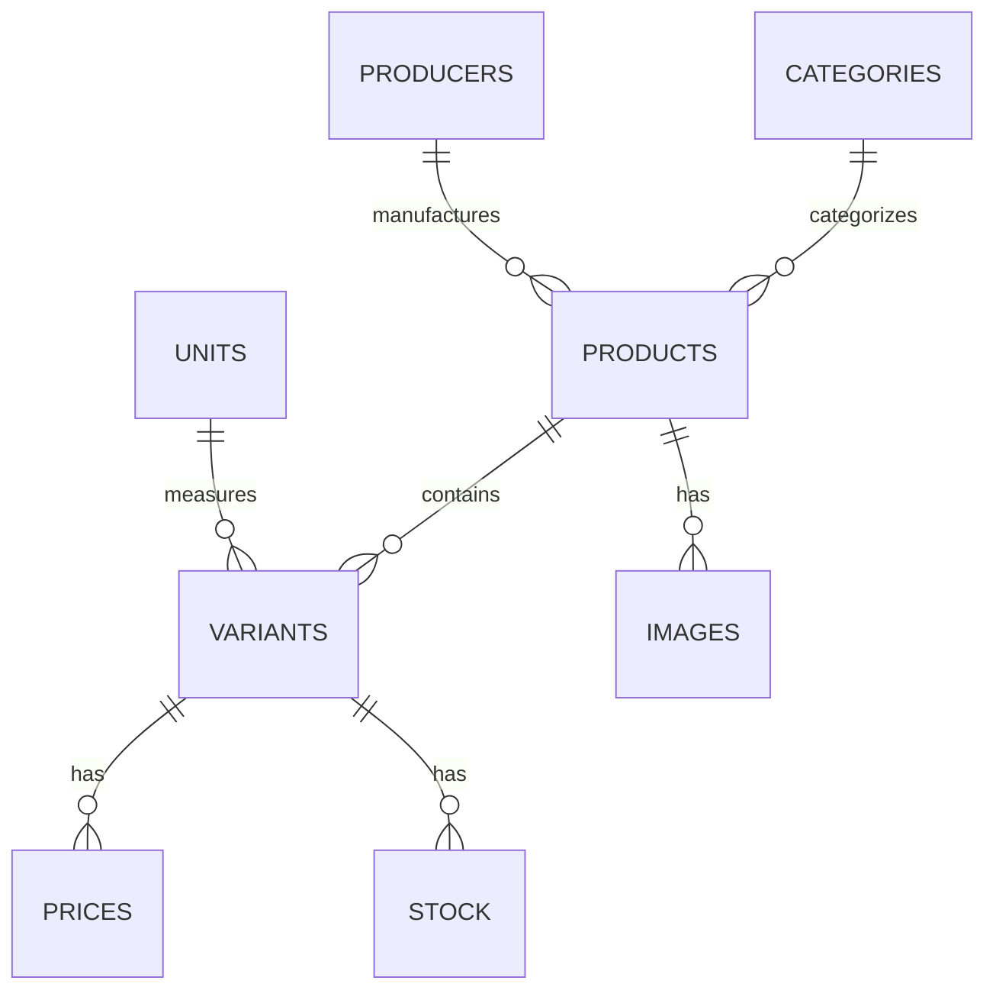

# PostgreSQL Database Schema Specification
> Documento criado: [2024-05-05 13:30]  
> Última atualização: [2025-05-08 23:45:00 UTC]

## Visão Geral

Este documento fornece uma descrição detalhada de todas as tabelas, campos, tipos de dados, chaves primárias, chaves estrangeiras e relacionamentos necessários para o projeto **AliTools B2B E-commerce**.

## Diagrama de Entidade Relacionamento



## Estrutura de Tabelas

### 1. Tabela `products`

Armazena os dados principais de cada produto.

| Coluna             | Tipo         | Restrições                                             | Descrição                            |
|---------------------|--------------|---------------------------------------------------------|---------------------------------------|
| `id`                | SERIAL       | PRIMARY KEY                                             | Identificador único do produto       |
| `code`              | TEXT         | NOT NULL                                                | Código interno                       |
| `code_on_card`      | TEXT         |                                                         | Código exibido no catálogo           |
| `ean`               | TEXT         | UNIQUE                                                  | Código de barras (EAN)               |
| `producer_code`     | TEXT         |                                                         | Código do fabricante                 |
| `name`              | TEXT         | NOT NULL                                                | Nome do produto                      |
| `description_long`  | TEXT         |                                                         | Descrição detalhada (HTML)           |
| `description_short` | TEXT         |                                                         | Descrição breve (HTML)               |
| `description_html`  | TEXT         |                                                         | Campo adicional de descrição completa|
| `vat`               | NUMERIC(5,2) |                                                         | Percentual de IVA                    |
| `delivery_date`     | DATE         |                                                         | Data de entrega (se aplicável)       |
| `url`               | TEXT         |                                                         | Link para a página externa do produto|
| `created_at`        | TIMESTAMP    | DEFAULT CURRENT_TIMESTAMP                              | Timestamp de criação do registro     |
| `updated_at`        | TIMESTAMP    | DEFAULT CURRENT_TIMESTAMP ON UPDATE CURRENT_TIMESTAMP | Timestamp da última atualização      |

### 2. Tabela `categories`

Armazena categorias hierárquicas de produtos.

| Coluna       | Tipo       | Restrições        | Descrição                            |
|--------------|------------|-------------------|------------------------------------|
| `id`         | TEXT       | PRIMARY KEY       | Identificador único da categoria    |
| `name`       | TEXT       | NOT NULL          | Nome da categoria                   |
| `path`       | TEXT       |                   | Caminho hierárquico da categoria   |
| `created_at` | TIMESTAMP  | DEFAULT CURRENT_TIMESTAMP | Timestamp de criação do registro |
| `updated_at` | TIMESTAMP  | DEFAULT CURRENT_TIMESTAMP ON UPDATE CURRENT_TIMESTAMP | Timestamp da última atualização |

### 3. Tabela `producers`

Armazena fabricantes dos produtos.

| Coluna       | Tipo       | Restrições        | Descrição                            |
|--------------|------------|-------------------|------------------------------------|
| `id`         | SERIAL     | PRIMARY KEY       | Identificador único do fabricante   |
| `name`       | TEXT       | NOT NULL, UNIQUE  | Nome do fabricante                  |
| `created_at` | TIMESTAMP  | DEFAULT CURRENT_TIMESTAMP | Timestamp de criação do registro |
| `updated_at` | TIMESTAMP  | DEFAULT CURRENT_TIMESTAMP ON UPDATE CURRENT_TIMESTAMP | Timestamp da última atualização |

### 4. Tabela `units`

Define unidades de medida e QMP (quantidade mínima de pedido).

| Coluna       | Tipo       | Restrições        | Descrição                            |
|--------------|------------|-------------------|------------------------------------|
| `id`         | TEXT       | PRIMARY KEY       | Identificador da unidade            |
| `name`       | TEXT       | NOT NULL          | Nome da unidade (ex: pçs, kpl)      |
| `moq`        | INTEGER    | NOT NULL          | Quantidade mínima de pedido         |
| `created_at` | TIMESTAMP  | DEFAULT CURRENT_TIMESTAMP | Timestamp de criação do registro |
| `updated_at` | TIMESTAMP  | DEFAULT CURRENT_TIMESTAMP ON UPDATE CURRENT_TIMESTAMP | Timestamp da última atualização |

### 5. Tabela `variants`

Variações de produtos (por tamanho, cor, etc.).

| Coluna         | Tipo       | Restrições                           | Descrição                            |
|----------------|------------|--------------------------------------|------------------------------------|
| `id`           | SERIAL     | PRIMARY KEY                          | Identificador único da variante     |
| `product_id`   | INTEGER    | NOT NULL, FOREIGN KEY → products(id) | Referência ao produto principal     |
| `code`         | TEXT       | NOT NULL                             | Código da variante                  |
| `weight`       | NUMERIC    |                                      | Peso líquido (em gramas)            |
| `gross_weight` | NUMERIC    |                                      | Peso bruto (em gramas)              |
| `created_at`   | TIMESTAMP  | DEFAULT CURRENT_TIMESTAMP            | Timestamp de criação do registro    |
| `updated_at`   | TIMESTAMP  | DEFAULT CURRENT_TIMESTAMP ON UPDATE CURRENT_TIMESTAMP | Timestamp da última atualização |

### 6. Tabela `stock`

Quantidade de cada variante disponível em cada armazém.

| Coluna         | Tipo       | Restrições                           | Descrição                                  |
|----------------|------------|--------------------------------------|----------------------------------------------|
| `id`           | SERIAL     | PRIMARY KEY                          | Identificador único do registro de estoque  |
| `variant_id`   | INTEGER    | NOT NULL, FOREIGN KEY → variants(id) | Referência à variante                       |
| `warehouse_id` | TEXT       | NOT NULL                             | Identificador do armazém                    |
| `quantity`     | INTEGER    | NOT NULL                             | Quantidade disponível                        |
| `created_at`   | TIMESTAMP  | DEFAULT CURRENT_TIMESTAMP            | Timestamp de criação do registro            |
| `updated_at`   | TIMESTAMP  | DEFAULT CURRENT_TIMESTAMP ON UPDATE CURRENT_TIMESTAMP | Timestamp da última atualização |

### 7. Tabela `prices`

Preços para cada variante, incluindo PVR.

| Coluna        | Tipo          | Restrições                           | Descrição                                |
|---------------|---------------|--------------------------------------|------------------------------------------|
| `id`          | SERIAL        | PRIMARY KEY                          | Identificador único do registro de preço |
| `variant_id`  | INTEGER       | NOT NULL, FOREIGN KEY → variants(id) | Referência à variante                    |
| `gross_price` | NUMERIC(10,2) | NOT NULL                             | Preço bruto                              |
| `net_price`   | NUMERIC(10,2) | NOT NULL                             | Preço líquido                            |
| `srp_gross`   | NUMERIC(10,2) |                                      | PVR bruto (opcional)                     |
| `srp_net`     | NUMERIC(10,2) |                                      | PVR líquido (opcional)                   |
| `created_at`  | TIMESTAMP     | DEFAULT CURRENT_TIMESTAMP            | Timestamp de criação do registro         |
| `updated_at`  | TIMESTAMP     | DEFAULT CURRENT_TIMESTAMP ON UPDATE CURRENT_TIMESTAMP | Timestamp da última atualização |

### 8. Tabela `images`

URLs de imagens associadas a cada produto.

| Coluna       | Tipo       | Restrições                           | Descrição                            |
|--------------|------------|--------------------------------------|------------------------------------|
| `id`         | SERIAL     | PRIMARY KEY                          | Identificador único da imagem       |
| `product_id` | INTEGER    | NOT NULL, FOREIGN KEY → products(id) | Referência ao produto               |
| `url`        | TEXT       | NOT NULL                             | URL da imagem                       |
| `created_at` | TIMESTAMP  | DEFAULT CURRENT_TIMESTAMP            | Timestamp de criação do registro    |
| `updated_at` | TIMESTAMP  | DEFAULT CURRENT_TIMESTAMP ON UPDATE CURRENT_TIMESTAMP | Timestamp da última atualização |

## Índices e Performance

- **Índice em `products(name)`** para buscas rápidas.
- **Índice composto em `variants(product_id, code)`** para consultas de variantes.
- **Índice em `stock(variant_id)`** para consultas de estoque.

Consulte [Database Indexes](./database-indexes.md) para informações detalhadas sobre todos os índices.

## Considerações de Implementação

- Use `ON CONFLICT DO NOTHING` durante operações de importação para evitar duplicação.
- Aplique validações de formato (regex) para `ean` e URLs antes da inserção.
- Normalize campos de texto (trim, escape HTML) conforme necessário.
- Assegure que todas as tabelas incluam colunas `created_at` e `updated_at` para suportar consultas temporais e auditoria, conforme exigido por `rules.database.timestamp_guidelines`. Esses timestamps facilitam o rastreamento do histórico de registros e a depuração de problemas de dados.

## Relações Entre Tabelas

```
products <-- variants <-- prices
    ^          ^
    |          |
    v          v
categories    stock
    
producers --> products
    
products --> images
```

## Integridade e Segurança de Dados

- Todas as chaves estrangeiras têm restrições apropriadas para manter a integridade referencial
- Campos que não podem ser nulos são devidamente marcados
- Os timestamps automáticos garantem o rastreamento de atualizações
- Campos de texto usam o tipo `TEXT` para flexibilidade em vez de limites rígidos de `VARCHAR`

## Scripts de Migração

Os scripts de migração para criar este esquema estão disponíveis em `server/src/migrations/`. Consulte esses arquivos para ver detalhes específicos da implementação SQL.

## Dados de Teste

Para informações sobre dados de teste e seed, consulte [Seed Data](./seed-data.md).

---

> Última atualização: [2025-05-08 23:45:00 UTC]  
> Autor: Claude