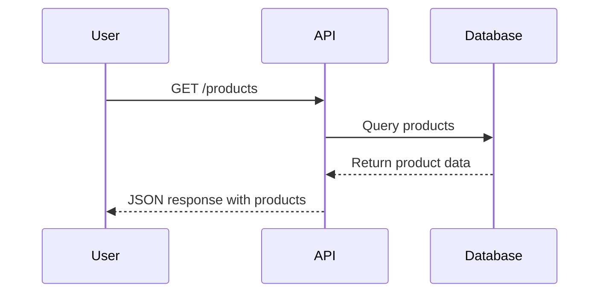

# Documentation Standards

This document outlines the standards and best practices for documentation in the AliTools B2B E-commerce Platform project.

## General Principles

- **Completeness**: Documentation should cover all aspects of the feature/component
- **Clarity**: Use simple, clear language that is easy to understand
- **Consistency**: Follow consistent formatting and structure across documents
- **Correctness**: Ensure all information is accurate and up-to-date
- **Code Examples**: Include relevant code examples when appropriate
- **Practical Focus**: Emphasize practical use cases and implementation details

## Documentation Types

### 1. Code Documentation

- **JSDoc Comments**: Use JSDoc for documenting JavaScript/TypeScript functions and classes
- **Component Documentation**: Document React components with prop definitions
- **API Documentation**: Document API endpoints, parameters, and responses

### 2. Feature Documentation

- **Overview**: Clearly explain what the feature does and why it exists
- **Implementation Details**: Document how the feature is implemented
- **User Guide**: Include instructions for using the feature
- **Testing Strategy**: Document how the feature should be tested

### 3. Process Documentation

- **Workflows**: Document development, deployment, and operational workflows
- **Standards**: Document coding standards, conventions, and best practices
- **Troubleshooting**: Document common issues and their solutions

## File Naming Conventions

- Use lowercase kebab-case for file names (e.g., `api-endpoints.md`)
- Be descriptive but concise
- Group related documentation in directories
- Use consistent naming patterns for related documents

## Document Structure

### Markdown Formatting

- Use Markdown for all documentation
- Use appropriate heading levels (# for title, ## for sections, etc.)
- Use code blocks with appropriate language tags
- Use lists, tables, and other formatting elements as needed
- Include diagrams as necessary (store diagram source files alongside documentation)

### Standard Sections

Most documentation should include these sections:

1. **Title**: Clear, descriptive title
2. **Overview**: Brief description of the document's purpose
3. **Main Content**: Detailed information organized logically
4. **Related Documentation**: Links to related documents
5. **Changelog**: Record of significant changes to the document

## Timestamping

All documentation updates should include timestamps in the following format:

- **Format**: `[YYYY-MM-DD HH:MM]`
- **Location**: At the beginning of each entry or update section
- **Required Information**:
  - Date and time of update
  - Brief description of changes
  - Version number (when applicable)

### Example Documentation Update

```markdown
## Feature Updates

### JWT Authentication Implementation

- **Timestamp**: [2023-06-20 09:45]
- **Changes**: 
  - Added JWT authentication to API endpoints
  - Implemented token refresh mechanism
  - Updated login flow to use JWT
- **Related Files**: 
  - `server/src/middleware/auth.js`
  - `server/src/controllers/authController.js`
  - `client/src/hooks/useAuth.js`
- **Version**: v1.2.0
```

## Templates

Use the standard templates provided in `docs/templates/` for creating new documentation:

- [API Endpoint Documentation Template](../templates/api_endpoint_template.md)
- [Feature Documentation Template](../templates/feature_template.md)
- [Task Template](../templates/task_template.md)
- [Error Tracking Entry Template](../templates/error_tracking_entry_template.md)

## Diagrams and Visual Aids

- **Format**: Use PlantUML, Mermaid, or simple ASCII diagrams
- **Storage**: Store diagram source files alongside documentation
- **Clarity**: Ensure diagrams are clear and easy to understand
- **Consistency**: Use consistent styling and notation

### Example Diagram (Mermaid)



## Code Examples

- Include code examples that demonstrate actual implementation
- Use syntax highlighting
- Include comments to explain complex parts
- Keep examples concise but complete
- Use real code from the project when possible

```javascript
// Example authentication middleware
export const checkAuth = async (req, res, next) => {
  try {
    // Get token from header
    const token = req.header('Authorization')?.replace('Bearer ', '');
    
    if (!token) {
      return res.status(401).json({ error: 'Authentication required' });
    }
    
    // Verify token
    const decoded = jwt.verify(token, process.env.JWT_SECRET);
    req.user = decoded;
    
    next();
  } catch (error) {
    res.status(401).json({ error: 'Invalid token' });
  }
};
```

## API Documentation Format

API endpoints should be documented using this format:

```markdown
### `GET /api/resource`

Description of what the endpoint does.

**Authentication Required**: Yes/No

**Query Parameters:**
| Parameter | Type | Required | Default | Description |
|-----------|------|----------|---------|-------------|
| `param1`  | string | No | `default` | Description of parameter |

**Response:**
```json
{
  "status": "success",
  "data": {
    "key": "value"
  }
}
```
```

## Documentation Review

All documentation should be reviewed for:

1. **Technical accuracy**
2. **Completeness**
3. **Clarity and readability**
4. **Consistency with standards**
5. **Correct formatting**

## Documentation Maintenance

- Update documentation when code changes
- Archive outdated documentation rather than deleting it
- Review and refresh documentation regularly
- Link related documentation together

## Cursor Rules

Cursor rules are special documentation files stored in `.cursor/rules/` that provide AI-assisted guidance for development. These rules should follow the format defined in `.cursor/rules/cursor_rules_template.mdc`.

## Version Control

- Store all documentation in the project repository
- Include documentation changes in relevant pull requests
- Use clear commit messages for documentation updates
- Consider using a [DOCS] prefix in commit messages for documentation-only changes

## Final Notes

Documentation is a crucial part of our development process. Good documentation:

- Reduces onboarding time for new developers
- Improves code quality by clarifying requirements and implementation details
- Serves as a reference for future development
- Helps prevent knowledge loss when team members change

Treat documentation as a first-class citizen in the development process, not an afterthought. 